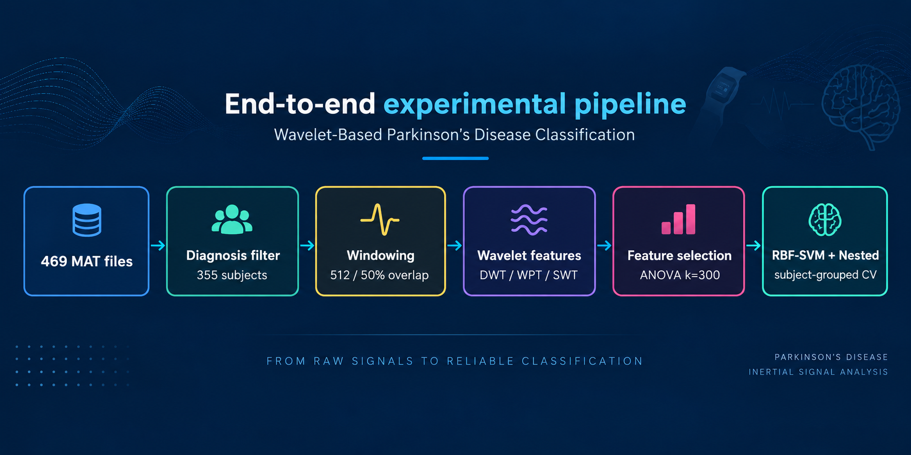
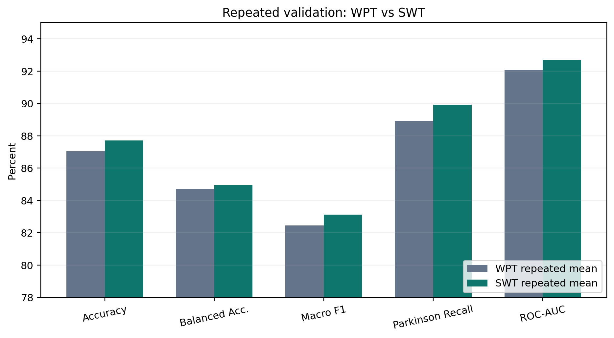
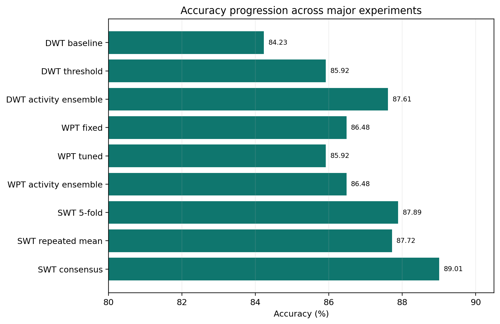

# Wavelet-Based Parkinson's Disease Classification Using Inertial Wrist Signals



## Overview

This project presents a machine learning framework for Parkinson's
disease classification using inertial wrist sensor signals and
wavelet-based feature extraction.

The proposed pipeline investigates multiple time-frequency
representations:

-   Discrete Wavelet Transform (DWT)
-   Wavelet Packet Transform (WPT)
-   Stationary Wavelet Transform (SWT)

The objective is to build a subject-independent classification system
while preventing data leakage during evaluation.

------------------------------------------------------------------------

## Research Objective

Parkinson's disease affects motor control and movement patterns.
Inertial sensors provide a non-invasive method for analyzing movement
characteristics through accelerometer and gyroscope signals.

This project studies whether wavelet-based representations can capture
discriminative movement patterns for classification between Parkinson's
disease and healthy control subjects.

------------------------------------------------------------------------

## Dataset

The project uses inertial wrist sensor recordings containing:

-   Accelerometer signals
-   Gyroscope signals
-   Multiple wrist channels
-   Parkinson's disease and healthy control groups

Dataset summary:

  Category                Value
  -------------------- --------
  Initial files             469
  Final subjects            355
  Parkinson subjects        276
  Healthy subjects           79
  Sampling frequency     100 Hz

The original dataset is not included due to size and licensing
constraints.

------------------------------------------------------------------------

## Methodology

The complete processing pipeline:

    Raw Inertial Signals
            |
            v
    Data Inspection and Preprocessing
            |
            v
    Window Segmentation
            |
            v
    Wavelet Feature Extraction
    (DWT / WPT / SWT)
            |
            v
    Feature Engineering and Selection
            |
            v
    Machine Learning Classification
            |
            v
    Subject-Level Validation
            |
            v
    Performance Evaluation

------------------------------------------------------------------------

## Wavelet Analysis

Three wavelet representations were evaluated:

### Discrete Wavelet Transform (DWT)

Used for multi-resolution decomposition and extraction of
frequency-domain characteristics.

### Wavelet Packet Transform (WPT)

Provides a more detailed frequency decomposition for feature
representation.

### Stationary Wavelet Transform (SWT)

Used as a shift-invariant representation to preserve temporal patterns.

------------------------------------------------------------------------

## Machine Learning Framework

Implemented approaches include:

-   Support Vector Machine (SVM)
-   Baseline machine learning models
-   Feature selection strategies
-   Ensemble analysis

The final selected configuration:

    Wavelet:
    SWT

    Mother wavelet:
    db4

    Level:
    5

    Classifier:
    RBF-SVM

------------------------------------------------------------------------

## Validation Strategy

A subject-level validation strategy was applied to prevent data leakage.

Samples from the same subject were kept exclusively in either training
or testing partitions.

Evaluation included:

-   Grouped validation
-   Repeated experiments
-   Accuracy analysis
-   ROC-AUC analysis
-   Confusion matrix evaluation

------------------------------------------------------------------------

## Results

Final SWT-based evaluation:

  Metric               Result
  ---------- ----------------
  Accuracy     87.72% ± 0.25%
  ROC-AUC              92.68%

Consensus evaluation:

  Metric       Result
  ---------- --------
  Accuracy     89.01%
  ROC-AUC      93.37%

------------------------------------------------------------------------

## Results Visualization

### SWT Confusion Matrix


### Wavelet Representation Comparison



### Model Accuracy Progression



------------------------------------------------------------------------

## Repository Structure

    Wavelet-Parkinson-Classification/

    ├── src/
    │   ├── preprocessing/
    │   ├── wavelet_features/
    │   ├── models/
    │   └── analysis/
    │
    ├── results/
    │   ├── figures/
    │   ├── metrics/
    │   └── reports/
    │
    ├── docs/
    ├── requirements.txt
    └── README.md

------------------------------------------------------------------------

## Installation

Clone the repository:

``` bash
git clone https://github.com/milad-rezaei-arjmand/Wavelet-Parkinson-Classification.git
cd Wavelet-Parkinson-Classification
```

Install dependencies:

``` bash
pip install -r requirements.txt
```

------------------------------------------------------------------------

## Data Availability

The original dataset is not included in this repository.

Users should obtain the dataset separately and configure the data paths
according to the project structure.

------------------------------------------------------------------------

## Citation

If you use this project in academic work, please cite:

**Wavelet-Based Parkinson's Disease Classification Using Inertial Wrist
Signals**
