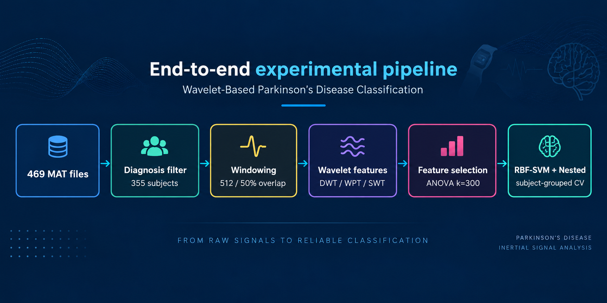
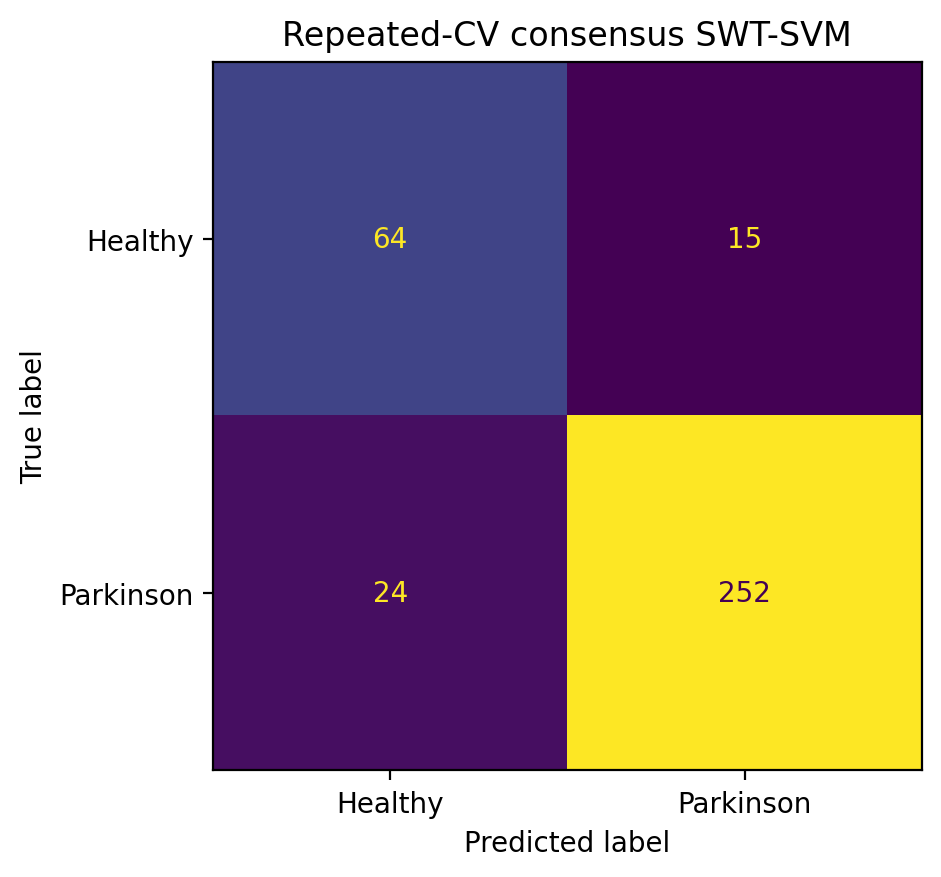
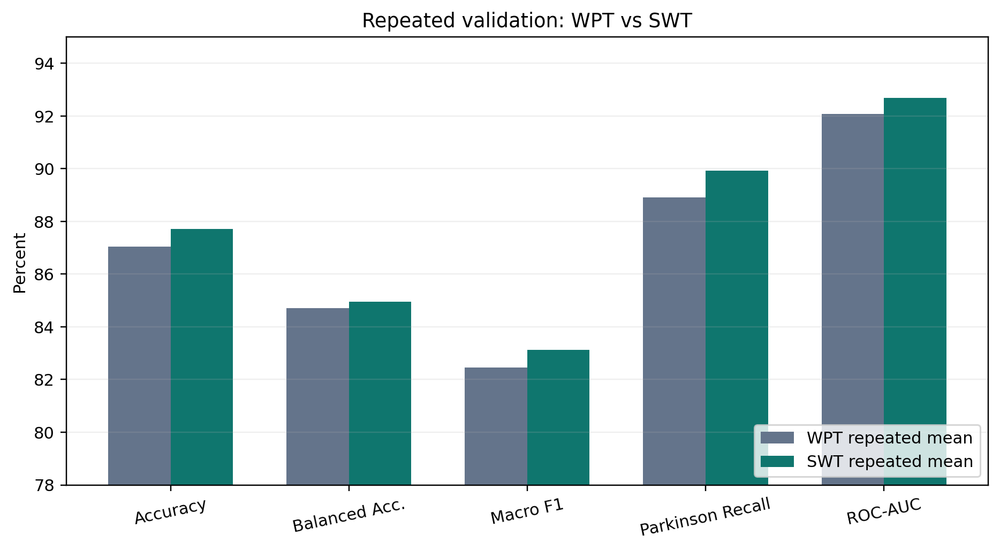
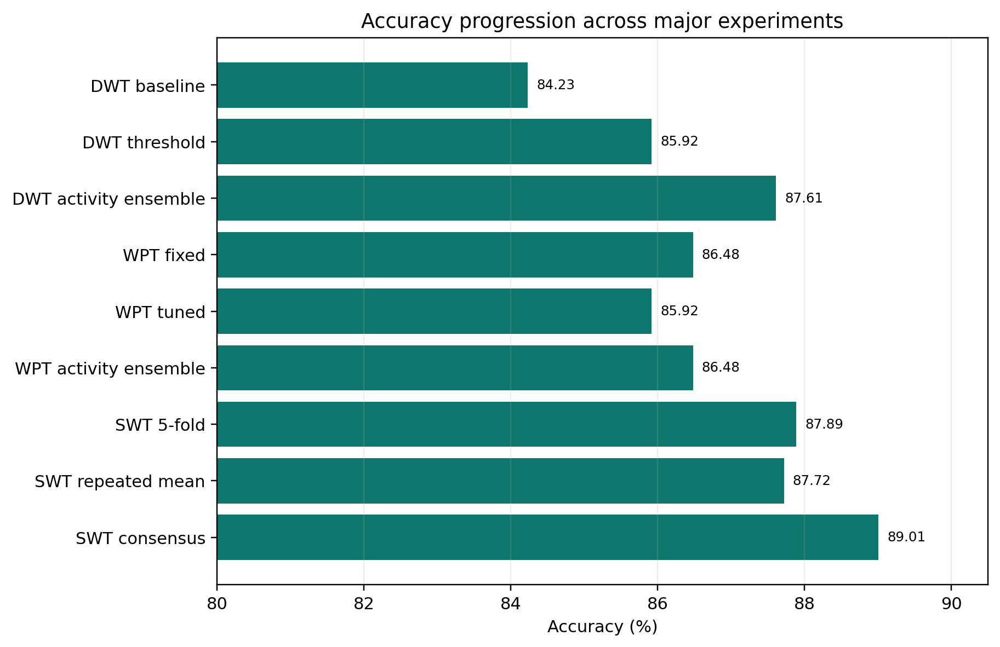

# Wavelet-Based Parkinson's Disease Classification Using Inertial Wrist Signals



## Overview

This repository presents a machine learning framework for Parkinson's disease classification using inertial wrist sensor signals and wavelet-based feature extraction.

Three time-frequency representations are investigated:

- Discrete Wavelet Transform (DWT)
- Wavelet Packet Transform (WPT)
- Stationary Wavelet Transform (SWT)

The project emphasizes **subject-level, leakage-free validation** so that windows from the same participant are never shared between training and test partitions.

---

## Research Objective

Parkinson's disease affects motor control and movement patterns. Wrist-worn inertial sensors provide a non-invasive way to characterize movement using accelerometer and gyroscope signals.

This project investigates whether wavelet-based representations can capture discriminative movement patterns for classification between Parkinson's disease and healthy control subjects.

---

## Dataset

The experiments use wrist inertial recordings with:

- Left and right wrist measurements
- 3-axis accelerometer signals per wrist
- 3-axis gyroscope signals per wrist
- 11 motor activities
- 100 Hz sampling frequency

Dataset summary:

| Category | Value |
|---|---:|
| Initial MATLAB files | 469 |
| Final subjects after diagnosis filtering | 355 |
| Parkinson subjects | 276 |
| Healthy subjects | 79 |
| Sampling frequency | 100 Hz |

The original dataset is **not distributed in this repository**. See [`data/README.md`](data/README.md) for the expected local data layout.

---

## Processing Pipeline

```text
Raw MATLAB files
        |
        v
File inspection and diagnosis filtering
        |
        v
Window inventory
(512 samples, 50% overlap)
        |
        v
Wavelet feature extraction
(DWT / WPT / SWT)
        |
        v
Feature selection
(VarianceThreshold + ANOVA F-test)
        |
        v
Machine-learning evaluation
        |
        v
Subject-level nested validation
        |
        v
Final metrics and analysis
```

---

## Wavelet Representations

### DWT

Discrete Wavelet Transform using `db4`, level 5.

### WPT

Wavelet Packet Transform using `db4`, level 4.

### SWT

Stationary Wavelet Transform using `db4`, level 5.

Statistical descriptors extracted from wavelet coefficients include mean, variance, standard deviation, energy, relative energy, Shannon entropy, interquartile range, skewness, and kurtosis.

---

## Final Model

The final selected configuration is:

```text
Representation: SWT
Mother wavelet: db4
Level: 5
Selected features: 300
Classifier: RBF-SVM
C: 10
gamma: scale
class_weight: balanced
```

---

## Validation Strategy

Evaluation is performed at the **subject level**.

The final SWT evaluation uses repeated nested grouped cross-validation:

- Outer folds: 5
- Inner folds: 4
- Repetitions: 5
- Grouping variable: subject
- Windows from the same subject are never split across train and test sets

This design is intended to reduce optimistic bias caused by window-level data leakage.

---

## Results

### Repeated SWT evaluation

| Metric | Result |
|---|---:|
| Accuracy | 87.72% ± 0.25% |
| Balanced Accuracy | 84.96% |
| Macro-F1 | 83.13% |
| Healthy Recall | 80.00% |
| Parkinson Recall | 89.93% |
| ROC-AUC | 92.68% |

### Consensus across five repetitions

| Metric | Result |
|---|---:|
| Accuracy | 89.01% |
| Balanced Accuracy | 86.16% |
| Macro-F1 | 84.73% |
| Healthy Recall | 81.01% |
| Parkinson Recall | 91.30% |
| ROC-AUC | 93.37% |

The WPT confidence/selective-classification analysis is exploratory. Higher accuracy reported at reduced coverage should **not** be interpreted as full-coverage classification performance.

---

## Result Visualizations

### Project pipeline


### SWT consensus confusion matrix



### Wavelet representation comparison



### Model accuracy progression



---

## Repository Structure

```text
Wavelet-Parkinson-Classification/
├── data/
│   └── README.md
├── docs/
│   └── technical_report.md
├── results/
│   ├── figures/
│   ├── metrics/
│   ├── reports/
│   └── README.md
├── src/
│   ├── preprocessing/
│   ├── wavelet_features/
│   ├── models/
│   └── analysis/
├── requirements.txt
├── LICENSE
└── README.md
```

Generated intermediate experiment files are written to a local `outputs/` directory and are intentionally excluded from version control.

---

## Installation

```bash
git clone https://github.com/milad-rezaei-arjmand/Wavelet-Parkinson-Classification.git
cd Wavelet-Parkinson-Classification

python -m venv .venv
source .venv/bin/activate

pip install -r requirements.txt
```

---

## Data Layout

After obtaining the dataset separately, place the MATLAB files under:

```text
data/
└── raw/
    ├── 001.mat
    ├── 002.mat
    └── ...
```

The raw files are ignored by Git.

---

## Reproducibility

Run scripts from the repository root.

### Core preprocessing

```bash
python src/preprocessing/01_inspect_files.py
python src/preprocessing/02_build_inventory.py
python src/preprocessing/03_build_window_inventory.py
```

### DWT branch

```bash
python src/wavelet_features/04_extract_dwt_features.py
python src/models/05_train_baselines.py
python src/models/06_tune_svm_threshold.py
python src/analysis/07_analyze_activities.py
python src/analysis/08_nested_activity_ensemble.py
python src/analysis/09_nested_stacking_ensemble.py
```

### WPT branch

```bash
python src/wavelet_features/10_extract_wpt_features.py
python src/analysis/11_screen_dwt_wpt_fusion.py
python src/models/12_tune_wpt_svm.py
python src/analysis/13_nested_wpt_activity_ensemble.py
python src/analysis/14_nested_wpt_hybrid_blend.py
python src/analysis/15_screen_wpt_bilateral_features.py
python src/analysis/16_screen_subject_level_wpt.py
python src/models/17_repeated_validate_wpt_svm.py
python src/analysis/18_analyze_wpt_confidence.py
```

### SWT branch and final validation

```bash
python src/wavelet_features/19_extract_swt_features.py
python src/analysis/20_screen_wpt_swt_fusion.py
python src/models/21_repeated_validate_swt_svm.py
```

For reproducing the final selected SWT model specifically, the shortest path is:

```text
01 -> 02 -> 03 -> 19 -> 21
```

Step 20 additionally requires WPT features from step 10 because it evaluates WPT-SWT fusion.

Intermediate feature tables and experimental outputs are written under `outputs/`.

---

## Technical Report

Additional methodological and experimental details are available in:

[`docs/technical_report.md`](docs/technical_report.md)

---

## Limitations

This repository represents a research workflow rather than a clinically validated diagnostic system.

Important limitations include:

- no external multi-center validation set,
- class imbalance between Parkinson and healthy subjects,
- limited clinical covariates,
- and dependence on the characteristics of the source dataset.

---

## Citation

If you use this repository in academic work, please cite the repository/project title:

**Wavelet-Based Parkinson's Disease Classification Using Inertial Wrist Signals**

Formal publication citation information can be added if the work is published.

---

## Author

**Milad Rezaei Arjmand**
M.Sc. Student in Biomedical Engineering (Bioelectric)
